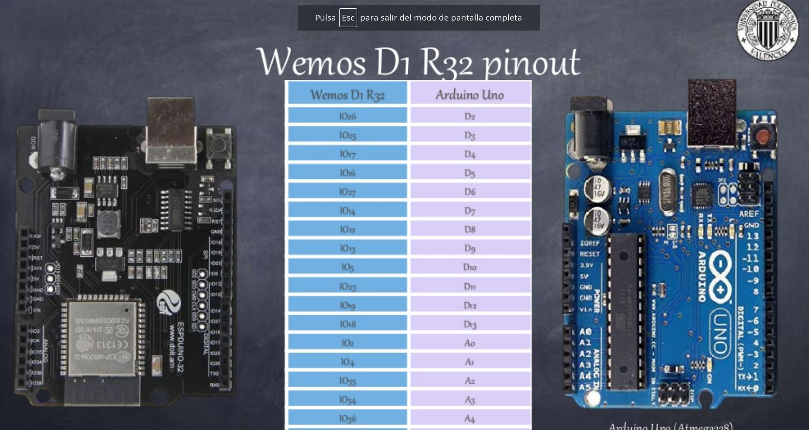

# Smart ESP32 Car


by @javacasm

La idea es hacer un transplante de cerebro al conocido Smart Car de Elegoo poniendo un Wemos D1 R32, compatible con el pinout de Arduino al que instalaremos micropython

## Conexionado 

El conexionado del coche es este


### Arduino vs Wemos D1 R32



Cortesía de [Leopoldo Armesto Ángel](https://www.slideshare.net/LeopoldoArmestongel)

### Servo: D3 - GPIO25

Una aplicación del PWM es el control de los conocidos servos (o servomotores)

```python

import machine

servo = machine.PWM(machine.Pin(25),freq = 50)
servo.duty(47) # Posicion minima
servo.duty(82) # Posicion central
servo.duty(119) # Posicion maxima

```

### Motor L298n

[Ejemplo](https://github.com/GuyCarver/MicroPython/blob/master/lib/L298N.py)

```python
class motor(In1,In2,EN):
	def move(self,speed):
		if speed>0:
			In1.value(1)
			In2.value(0)
		elif speec < 0:
			In1.value(0)
			In2.value(1)
		else
			In1.value(0)
			In2.value(0)
		EN.duty(abs(speed))
```


## Referencias

[Documentacion](https://www.elegoo.com/tutorial/Elegoo%20Smart%20Robot%20Car%20Kit%20V3.0%20Plus2019.12.11.zip)